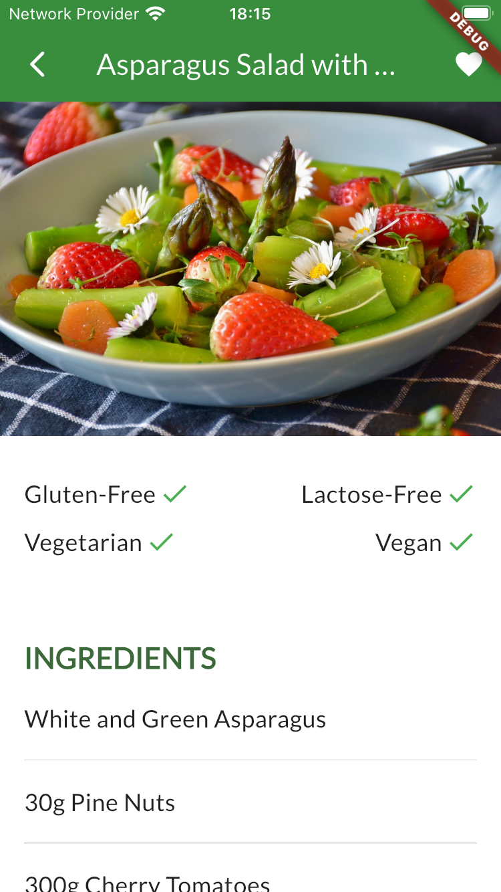
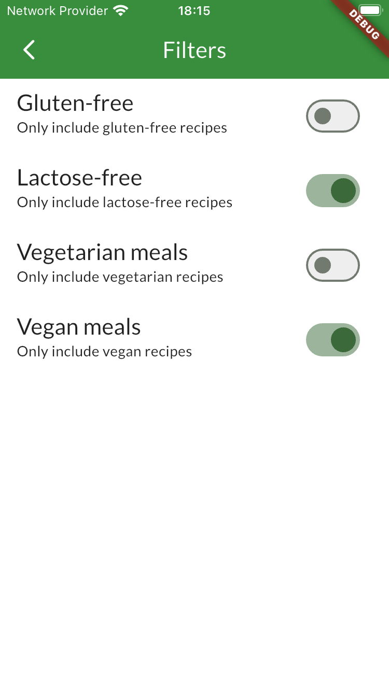
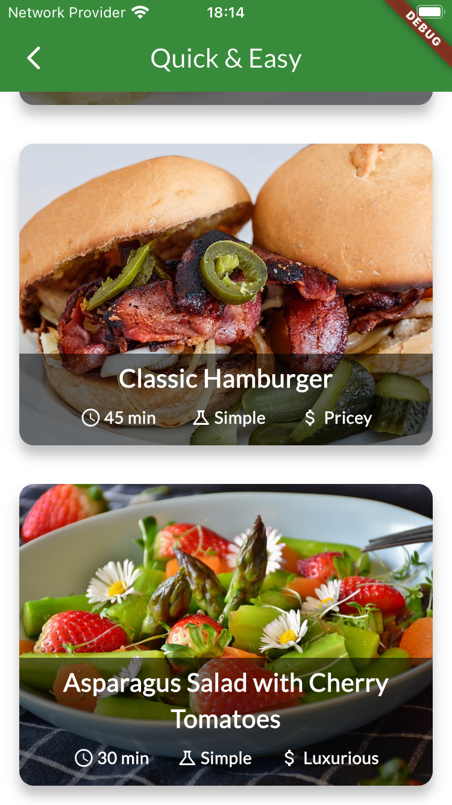

# Recipes App (Flutter)

## About
Multi-platform recipe application built with **Flutter**. You can view the various recipes among the categories present, filter and add them to your favorites.

  

## Note
This is just an exercise and not a real publishable app.
